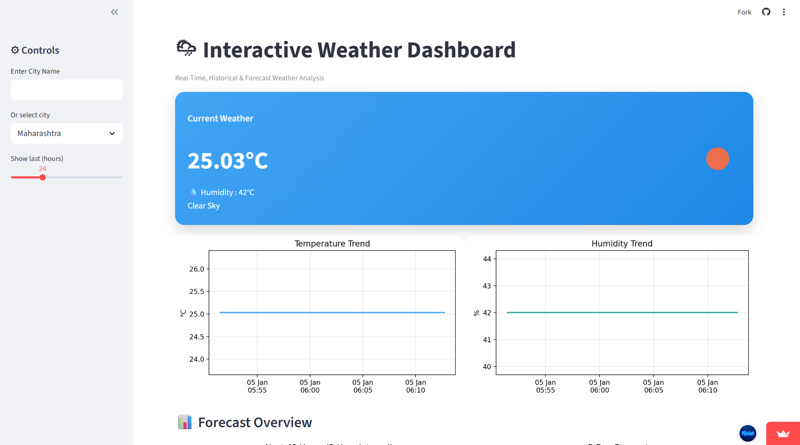
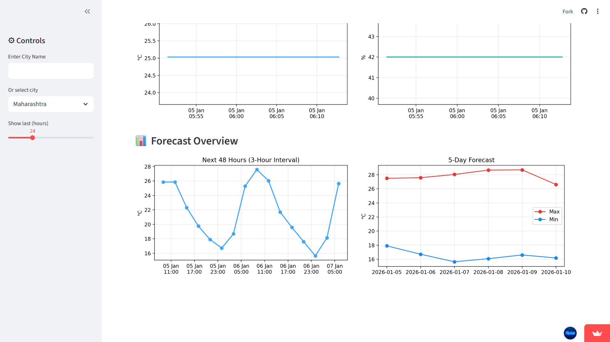

# 🌦 Interactive Weather Dashboard

A **professional, interactive weather analytics dashboard** built using **Python, Pandas, Matplotlib & Streamlit**, designed to visualize **real-time weather**, **historical trends**, and **short-term & long-term forecasts** in a clean, developer-friendly interface.

> 📊 Focused on clarity, performance, and real-world data visualization best practices.

---

## 🚀 Live Demo
🔗 **Streamlit App (Public)**  
🌐 https://interactive-weather-dashboard.streamlit.app/

---

**Dashboard Preview**



## ✨ Key Features

✅ Real-time weather data by city  
✅ Dynamic weather icons (API-driven)  
✅ Historical temperature & humidity trends  
✅ **Next 48 hours (3-hour interval) forecast**  
✅ **5-day daily forecast (Min / Max temperature)**  
✅ Clean Matplotlib charts  
✅ Smart handling of crowded x-axis labels  
✅ Modular, scalable, production-style architecture  

---

## 🧠 Tech Stack

| Layer | Technology |
|-----|------------|
Frontend | Streamlit |
Backend | Python |
Data Processing | Pandas |
Visualization | Matplotlib |
API | OpenWeather API |
Version Control | Git & GitHub |
Deployment | Streamlit Cloud |

---

## 🌍 API Used

**OpenWeather API**
- Current Weather Data
- 5-Day / 3-Hour Forecast

🔑 Create an API key here:  
👉 https://openweathermap.org/api

---

## ⚙️ Installation & Setup (Windows)

### 1️⃣ Clone the Repository
```bash
git clone https://github.com/Rohit-Patel-Techie/Interactive-Dashboard.git
cd Interactive-Dashboard

2️⃣ Create & Activate Virtual Environment
python -m venv venv
venv\Scripts\activate

3️⃣ Install Dependencies
pip install -r requirements.txt

4️⃣ Add Your API Key
API_KEY = "YOUR_OPENWEATHER_API_KEY"

5️⃣ Run the Application
streamlit run app/dashboard/app.py

🌐 Boom : The Dashboard will open automatically in your Default Browser.
